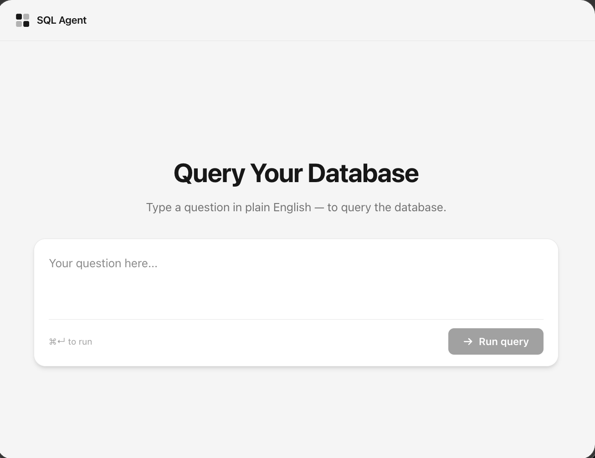

# nl-to-sql

A natural-language-to-SQL agent for SQL Server, PostgreSQL or MySQL. Type a question in English, the backend reads your database schema, has an LLM turn the question into a `SELECT` query, runs it, and returns the rows. Two parts:

- `backend/` — FastAPI service. Introspects the schema, generates SQL, validates it, retries on error, executes it.
- `front/` — React. Sends questions to the backend and displays results in a table.

It needs an external OpenAI-compatible LLM server (llama.cpp, Ollama, a cloud API, etc.) — this is not bundled and must already be running and reachable.

## What it looks like



This is the starting screen at `http://localhost:5173` — the heading uses your `DB_NAME`. Type a question and press ⌘↵ (or click **Run query**). The answer replaces this view: the prompt box shrinks to the top, a collapsible **Generated SQL** panel shows the query the LLM produced, and the rows fill the rest of the window in a table with sticky headers, drag-to-resize columns and a zoom control.

## How to set up

Requires Docker and Docker Compose.

1. Copy the env template and fill in your values:
   ```
   cp .env.example .env
   ```
   Set `DB_TYPE` (`mssql`, `postgresql` or `mysql`) and `DB_HOST`, `DB_PORT`, `DB_USER`, `DB_PASSWORD`, `DB_NAME` for your database (cloud or local, username/password auth). Use a read-only login. By default every table and view in the default schema is given to the LLM; set `DB_SCHEMA` or `DB_TABLES` to narrow that on large databases.

   Set `LLM_URL` and `LLM_MODEL` for your LLM endpoint. `LLM_MODEL` is required and must match the model name your server expects (an Ollama tag, a llama.cpp alias, a cloud model ID); the backend won't start without it.

2. Build and start both services:
   ```
   docker compose up --build
   ```
   Rebuild (`--build`) whenever you change `DB_TYPE`: the SQL Server ODBC driver is only installed into the image for `mssql`.

3. Open `http://localhost:5173`.

The backend is at `http://localhost:8000` (`GET /health` for a status check). If your LLM server runs on the same host machine as Docker, `LLM_URL=http://host.docker.internal:8080/...` (the default in `.env.example`) reaches it from inside the container.
